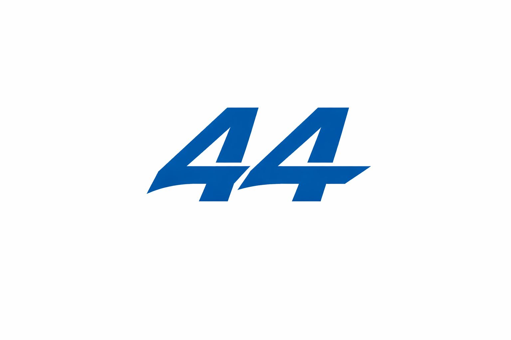

  <h1>🂡 <strong>Poker44</strong> — Adversarial Bot Detection Subnet</h1>
  
  

    <a href="docs/validator.md">🔐 Validator Guide</a> &bull;
    <a href="docs/miner.md">🛠️ Miner Guide</a> &bull;
    <a href="docs/roadmap.md">🗺️ Roadmap</a>
  

---

## What is Poker44?

Poker44 is a **Bittensor subnet for adversarial bot detection in competitive systems**, starting with **online poker** as its initial domain.

The subnet generates **controlled ground-truth datasets** where **humans and bots compete in the same environment**, producing realistic behavioral data that is extremely difficult to replicate through simulation alone.
Miners return **calibrated risk scores backed by evidence**, while validators perform **objective, reproducible evaluation** with strong penalties for false positives.

Poker44 is **security infrastructure**, not a game product.

---

## Our vision

### Building the Global Trust Infrastructure

Poker44 is evolving into a **behavior validation platform** where detection, prevention, and trust converge across digital ecosystems.

### Gaming is where it starts

Poker and online gaming represent the most adversarial environments: high incentives, observable behavior, and rapidly evolving bots designed to mimic humans.
This makes gaming the ideal laboratory to validate detection systems under real-world pressure — before expanding to other domains.

### The universal trust layer

Poker44 is building toward:
- Pre-game and in-game bot identification
- Cross-platform behavioral analysis
- Risk scoring with explainable evidence
- API/SDK for seamless integration
- Detection dashboards for security teams
- Automated action workflows

---

## Why this matters

Online platforms face a growing bot crisis. Adaptive agents increasingly operate alongside humans in games, trading systems, and competitive environments, degrading trust, fairness, and user experience.

The core failure is not model capability, but **evaluation**:
- Weak or synthetic-only datasets
- No reliable ground truth
- No continuous adversarial pressure

Poker44 addresses this by creating **living benchmarks** with reliable labels and evolving adversaries.

---

## Why Bittensor

Poker44 is an arms race — and Bittensor is purpose-built for arms races:

- Open competition between independently trained models
- Objective, validator-controlled evaluation
- Continuous improvement driven by incentives
- Transparent performance under shared rules

As the subnet scales, both platforms and the network benefit from a virtuous cycle of data, demand, and model improvement.

---

## How the subnet works

### Validators
Validators:
- Generate and curate labeled datasets from the Poker44 controlled environment
- Package canonical behavioral signals:
  - Action sequences and decision patterns
  - Timing, pacing, and adaptation traces
  - Contextual metadata and integrity hints
- Query miners and score responses using a validator metrics framework
- Refresh the evaluation snapshot and query miners every 1 hour by default
- Enforce low false-positive rates through strong penalties

### Miners
Miners:
- Consume standardized player behavior windows
- Return:
  - A probabilistic score: `P(bot | player, window)`
  - A binary classification
  - Optional evidence features (where supported)
- Compete on accuracy, calibration, robustness, and generalization to unseen bots, with a winner-take-all payout on each scoring window

Reference miners may ship with heuristics, but **production-grade ML models are expected** to win.

### Economic Policy
Poker44 uses a strict validator-controlled incentive policy:
- `97%` of emissions are assigned to `UID 0`
- `3%` are assigned to a single top-scoring eligible miner per scoring window
- miners with `FPR >= 10%` are disqualified for that window
- the validator uses a rolling reward window of `50` labeled chunk predictions by default

### Public Training Data
The public repo ships a compressed human-hand corpus at `hands_generator/human_hands/poker_hands_combined.json.gz`.
- it is intended as a base corpus for miner-side training
- bot hands are not shipped as a public training set
- miners are expected to generate their own bot hands from the provided generator and documentation
- validators do not use this public corpus for evaluation
- validators must point `POKER44_HUMAN_JSON_PATH` at a separate private local human-hand JSON distributed off-repo

---

## What Poker44 is *not*

To be explicit:
- ❌ Not a poker platform or gambling product
- ❌ Not competing with poker operators
- ❌ Not a static dataset or offline benchmark

Poker is a **means to an end**: generating high-value adversarial data and objective evaluation.

---

## Roadmap

### V0 — Foundation
Controlled poker environment, ground-truth dataset generation, and baseline bot detection with objective validator metrics.

### V1 — Advanced Detection
Behavioral modeling, timing and adaptation signals, early detection, and open API access with operator dashboards.

### V2 — Multi-Platform Expansion
Real-time detection, platform-agnostic framework, unseen-bot evaluation, and calibrated risk scoring.

### V3 — Commercial Scale
Platform pilots, full API/SDK suite, evidence-based dashboards, and automated action workflows.

### V4 — Global Trust Infrastructure
Cross-platform behavioral analysis, automated dataset evolution, developer tooling, and universal behavior validation.

---

## Contributing

Poker44 is built **in public**.

You can contribute by:
- Running a miner or validator
- Improving evaluation and scoring logic
- Building adapters and tooling
- Proposing new adversarial benchmarks

Constructive issues and PRs are welcome.

---

## License

MIT — see `LICENSE`.

Open code. Open evaluation. Open competition.
